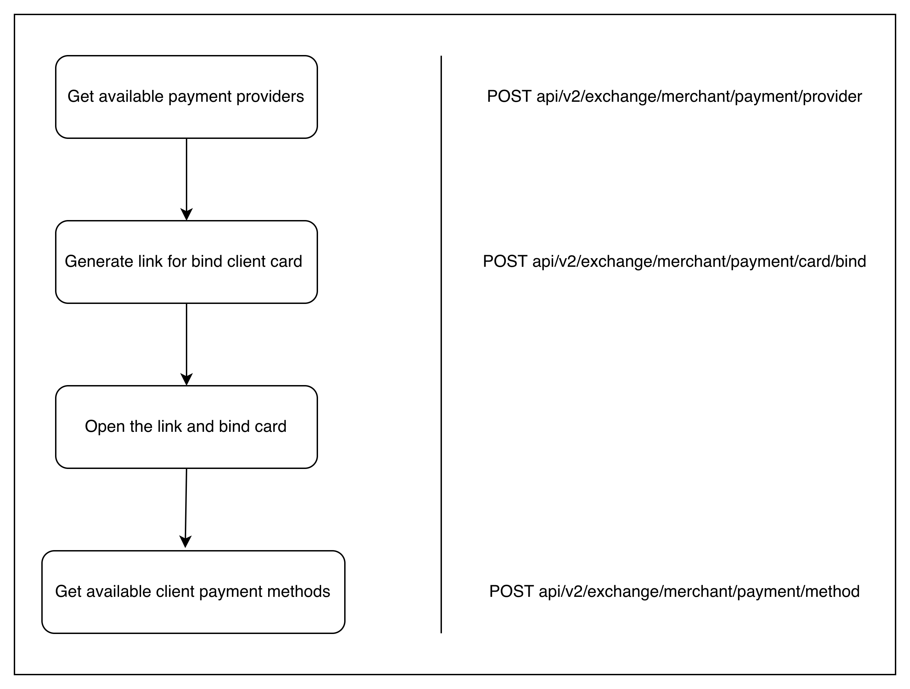
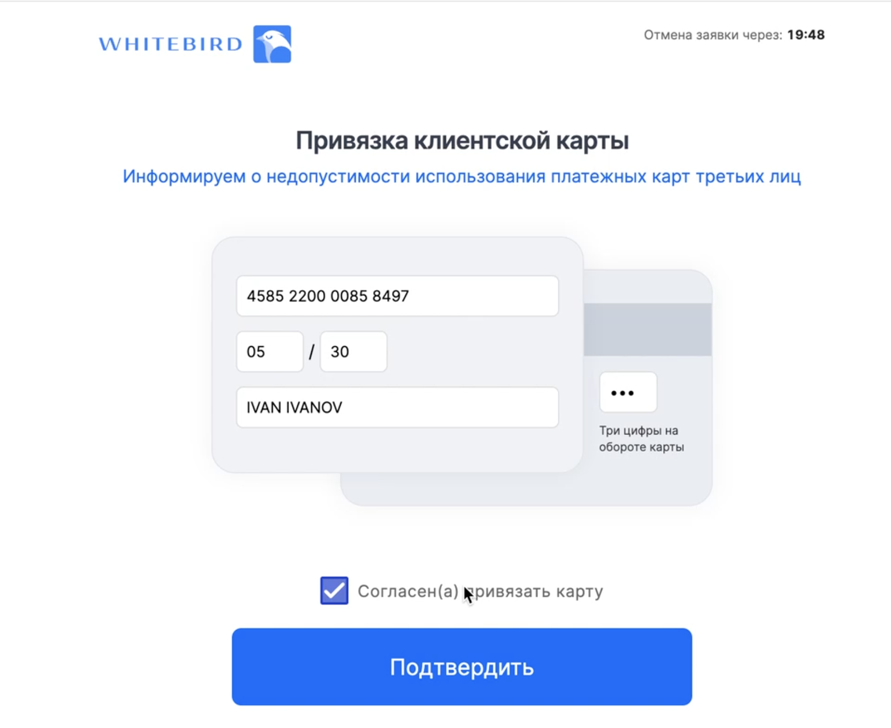
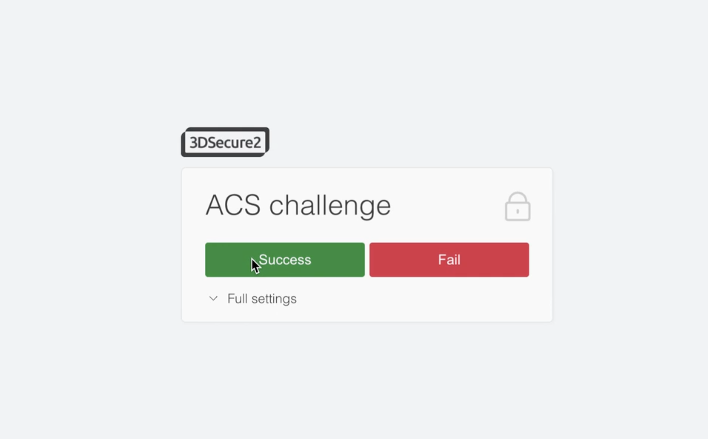

# ALFA

ALFA is a payment provider of Belarus AlfaBank. To use it, client need to bind their card

## Available currencies:

- BYN
- RUB
- USD
- EUR

## Available Bank Card By Region:

- Belarus
- Azerbaijan
- Armenia
- Kazakhstan
- Kyrgyzstan
- Moldova
- Tajikistan
- Turkmenistan
- Uzbekistan
- Georgia

## Directions & Commission:

- Buy Crypto 2,5 %
- Sell Sell 1,5 %

## Flow for binding card:



# First step

Verify that the payment provider is available

### POST api/v2/exchange/merchant/payment/provider

### Request Header:

x-api-key 

### Request Body:

```jsx
{
    "clientId": "93a8b39b-d883-4de3-9527-d92b1eabe38c",
    "fiatAsset": "BYN", -- optional (available BYN, RUB, USD, EUR)
    "orderType": "BUY"  -- optional (available BUY and SELL)
}
```

### Response:

```jsx
{
    "id": "ALFA",
    "name": "ALFA",
    "addPaymentMethod": true,
    "config": {
        "paymentSystems": [
            {
                "paymentSystem": "VISA",
                "type": "PSP",
                "directions": [
                    {
                        "direction": "SELL",
                        "currencies": [
                            {
                                "currency": "BYN",
                                "banks": [
                                    "Alfa Bank (Belarus)",
                                    "Belinvestbank",
                                    "Bank Dabrabyt",
                                    "Bank BelVEB",
                                    "Sber Bank (Belarus)"
                                ]
                            },
                            {
                                "currency": "USD",
                                "banks": [
                                    "Alfa Bank (Belarus)",
                                    "Belinvestbank",
                                    "Bank Dabrabyt",
                                    "Bank BelVEB",
                                    "Sber Bank (Belarus)"
                                ]
                            },
                            {
                                "currency": "EUR",
                                "banks": [
                                    "Alfa Bank (Belarus)",
                                    "Belinvestbank",
                                    "Bank Dabrabyt",
                                    "Bank BelVEB",
                                    "Sber Bank (Belarus)"
                                ]
                            },
                            {
                                "currency": "RUB",
                                "banks": [
                                    "Alfa Bank (Belarus)",
                                    "Belinvestbank",
                                    "Bank Dabrabyt",
                                    "Bank BelVEB",
                                    "Sber Bank (Belarus)"
                                ]
                            }
                        ]
                    }
                ]
            }
        ]
    }
}

```

It is sufficient to verify that the payment provider is available via the id field.  id = ALFA 

# Second step

Generate link to bind client card

### POST api/v2/exchange/merchant/payment/card/bind

### Request Header:

x-api-key 

### Request Body:

`returnUrl` - Link to the resource where the client should be redirected after binding the card 

```jsx
{
    "clientId": "1a0e2c64-8a90-4144-ac05-5e66bde1ca84",
    "providerType": "ALFA",
    "returnUrl": "https://www.google.com"
}
```

### Response:

```jsx
{
    "url": "https://abby.rbsuat.com/payment/merchants/whitebird/payment.html?mdOrder=13e70051-a19b-73d3-a7e9-309600dfc911&language=ru"
}
```

# Third step

Open link for the client to bind their card 

Test card data:
Number: 4585220000858497
Expiration time: 05/30
CVV: 078

                                                             Enter your card details 



                                 Confirm 3ds verification by click on the “Success” button



              After completing the card binding, you will be redirected to the returnUrl you specified

  How can I find out the result of a card binding?  
Use webhooks from Whitebird or use the request from step four

### There are three webhooks from Wthitebird:

### client.payment.method.binding

Сlient initiated card binding

```
{
    "id": "webhook-id",
    "clientId": "ed8ff528-3017-45bc-9d4d-f90e58f91bf9",
    "bindId": "856c460d-7081-433b-904d-c46e313b1225",
    "providerType": "ALFA",
    "createdAt": "2025-04-21T09:00:17+0000",
    "type": "client.payment.method.binding"
}
```

### client.payment.method.bound

Сlient's card was successfully bound

```
{
    "id": "webhook-id",
    "clientId": "ed8ff528-3017-45bc-9d4d-f90e58f91bf9",
    "paymentToken": "7ee5900d-7a02-4bcf-a757-7a7b2fce462d",
    "providerType": "ALFA",
    "createdAt": "2025-04-21T13:51:26+0000",
    "type": "client.payment.method.bound"
}
```

### client.payment.method.failed

Сlient did not bind the card or the binding was declined by the bank

```
{
    "id": "webhook-id",
    "clientId": "5646c1b7-d934-44ce-8490-938feb810910",
    "bindId": "97d009fe-80e6-426d-8ea2-9784f676e08e",
    "cardMask": "0380",
    "brand": "MASTERCARD",
    "providerType": "ALFA",
    "createdAt": "2025-04-22T07:47:31+0000",
    "type": "client.payment.method.failed"
} 
```

If the client has successfully bound their card, you can get the card id in Whitebird as the paymentToken value

# Fourth step

Get available payment methods for the client 

### POST api/v2/exchange/merchant/payment/method

### Request Header:

x-api-key 

### Request Body:

```jsx
{
    "clientId": "93a8b39b-d883-4de3-9527-d92b1eabe38c",
    "fiatAsset": "BYN", -- optional (available BYN, RUB, USD, EUR)
    "orderType": "BUY"  -- optional (available BUY and SELL)
}
```

### Response:

```jsx
[
    {
        "id": "ee6693e1-c340-47cb-8b9e-29304b6d9fd8",
        "number": "**** **** **** 8497",
        "brand": "VISA",
        "providerId": "ALFA",
        "providerType": "ALFA",
        "status": "ENABLED",
        "isRestricted": false,
        "isCrypto": false,
        "country": "Russia"
    }
]
```

If the card status is ENABLED, the id field value can be used for the exchange operation as the paymentToken field
