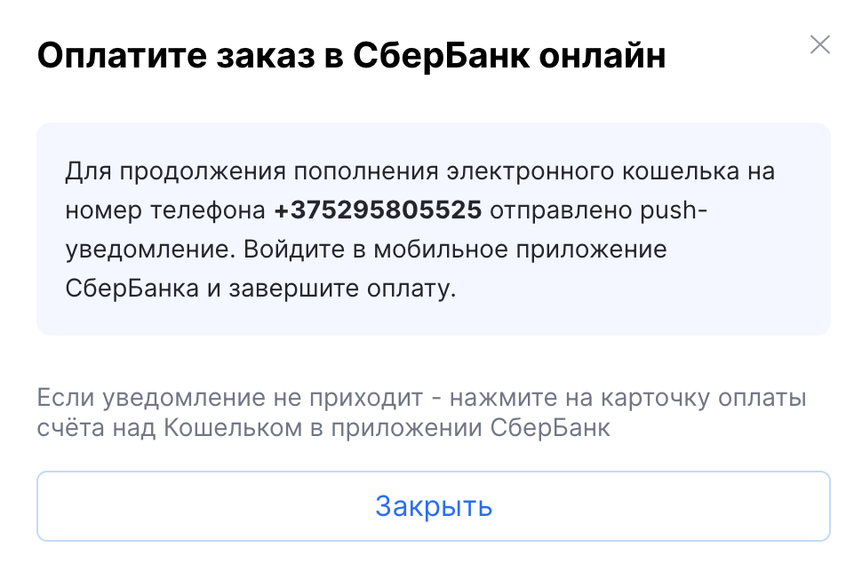

# SBER

SBER is a payment provider for RUB operations. In merchant configuration it can be routed via CA-type payment system.

## Available currencies:

- RUB

## Available Bank Card By Region:

- Russia

## Directions & Commission:

- Buy Crypto 1.5%
- Sell Crypto - not available in current configuration

## Verify that the payment provider is available

### POST api/v2/exchange/merchant/payment/provider

### Request Header:

x-api-key 

### Request Body:

```jsx
{
    "clientId": "3e1469fa-8d35-441c-87b1-a007aeba2562",
    "fiatAsset": "RUB", // optional (available RUB)
    "orderType": "BUY" // optional (available BUY)
}
```

### Response:

```jsx
{
        "id": "SBER",
        "name": "SBER",
        "addPaymentMethod": false,
        "config": {
            "paymentSystems": [
                {
                    "paymentSystem": "MIR",
                    "type": "CA",
                    "directions": [
                        {
                            "direction": "BUY",
                            "currencies": [
                                {
                                    "currency": "RUB",
                                    "banks": [
                                        "Sber Bank"
                                    ]
                                }
                            ]
                        }
                    ]
                }
            ]
        },
```

It is sufficient to verify that the payment provider is available via the id field.  id = SBER 

# Buy Crypto Flow:

## First step

Get available payment methods for the client 

### POST api/v2/exchange/merchant/payment/method

### Request Header:

x-api-key 

### Request Body:

```jsx
{
    "clientId": "3e1469fa-8d35-441c-87b1-a007aeba2562",
    "fiatAsset": "RUB", // optional (available RUB)
    "orderType": "BUY"  // optional (available BUY)
}
```

### Response:

```jsx
[
    {
        "providerId": "SBER",
        "providerType": "SBER",
        "status": "ENABLED",
        "name": "SBER"
    }
]
```

If `SBER` is not returned (or returned with non-`ENABLED` status), this means `BUY` via SBER is not available for the current client/merchant/environment

## Second step

Create a deposit for the selected SBER payment method

### POST api/v2/exchange/merchant/balance/fiat/deposit

### Request Header:

x-api-key 

### Request Body:

```jsx
{
  "clientId": "3e1469fa-8d35-441c-87b1-a007aeba2562",
  "accountType": "WALLET",
  "fiatProviderType": "SBER",
  "paymentToken":"de7ea37e-beff-49e4-8064-2b4cd1ae0c60",
  "asset": {
    "code": "RUB",
    "amount": "1299.77"
  }
}

```

### Response:

```jsx
{
    "fiatPaymentLink": null,
    "creationDate": "2026-04-02T12:34:54+0000",
    "expirationMinutes": 30,
    "paymentDetails": {
        "paymentLink": null,
        "notificationPhoneNumber": "375295805525"
    }
}
```

## Third step

In production flow, after SBER deposit creation the client must complete payment in the **SberBank mobile app:**



**“A push notification has been sent to phone `+375295805525`. Open the SberBank mobile app and complete payment.”**

If push is not received, use fallback path in app:

**“Select the account payment card above the wallet and complete payment there.”**

After confirmation in Sber app, keep polling merchant balance operation status **`(fourth step)`** until final state (**`PROCESSED`** / **`DECLINED`**).

## Fourth step

 Check current fiat operation status for this client.

### POST api/v2/exchange/merchant/balance/operation?page=0&size=10&sort=creationDate,desc

### Request Header:

x-api-key 

### Request Body:

```jsx
{
  "clientId": "3e1469fa-8d35-441c-87b1-a007aeba2562"
}
```

### Response:

```jsx
{
    "id": "e705a308-7a02-42b6-b6f6-0761ef558e11",
    "number": "3529",
    "type": "DEPOSIT",
    "status": "PROCESSING",
    "post": null,
    "providerType": "SBER",
    "paymentSystem": null,
    "transactionHash": null,
    "externalCryptoAddress": null,
    "asset": "RUB",
    "amount": "1000",
    "requestedAmount": "1000",
    "clientId": "3e1469fa-8d35-441c-87b1-a007aeba2562",
    "userId": "86c2b12b-a332-49ad-a447-d02c0b621dc4",
    "creationDate": "2026-04-02T13:07:37+0000",
    "completionDate": "2026-04-02T13:07:38+0000"
},
```
